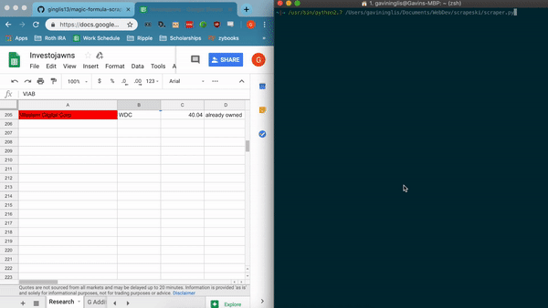

# magic-formula-scraper

Python script for scraping [magicformulainvesting.com](https://www.magicformulainvesting.com/) and appending data to a Google Sheet using [selenium](https://www.seleniumhq.org/), [Google Sheets API](https://developers.google.com/sheets/api/), and [gspread](https://gspread.readthedocs.io/en/latest/).

My brother and I make investments by following Joel Greenblatt's Magic Formula.
The site above uses this formula and outputs the top X companies that fit within
the criteria of the formula. However, the site does not allow a user to copy the information of
these companies from the webpage directly. Manually typing out the names of 30+ companies and their information
is a time-suck, so I created this script to scrape this information instead.

Example GIF
------
Here is the script running using a headless version of the Google Chrome browser, one w/o a GUI. 


Features
------
+ opens a safari browser to the magic formula login page, then uses selenium's Keys and the getpass library to enter login information
+ once logged in, selects the number of stocks to view and clicks the corresponding button to display them
+ scrapes information about listed companies, writes to csv file titled 'companies.csv'
+ appends data to spreadsheet using the Google Sheets API and gspread 
+ Optional: can be turned into a cronjob, instructions below

### Main Loop
This is where the data is both written to a csv file and added to a Google worksheet
```python
# find all td elements, write needed elements to file
trs=driver.find_elements_by_xpath('//table[@class="divheight screeningdata"]/tbody/tr')

for tr in trs:
    td = tr.find_elements_by_xpath(".//td")
    # encode company info as string to write to file
    company_name=td[0].get_attribute("innerHTML").encode("UTF-8")
    company_tikr=td[1].get_attribute("innerHTML").encode("UTF-8")
    # write to csv file
    writer.writerow([company_name,company_tikr])
    # append row to the google worksheet
    worksheet.append_row([company_name,company_tikr]) 

driver.quit()
```

Usage
------
1. [Create a Google Developer Account](https://console.developers.google.com/). This allows access to Google's Drive and Sheets APIs, as well as a ton of other resources. Signing up gives the user $300 in credit!

2. [Read the gspread docs on how to generate credentials](https://gspread.readthedocs.io/en/latest/oauth2.html). This will help with linking your worksheet to the script. Make sure you put the path to the JSON file on line 74!

3. Some parts of the script will have to be personalized by the user. These sections of scraper.py are listed below.

#### Line 74
```python
credentials = ServiceAccountCredentials.from_json_keyfile_name('/path/to/your/credentials', scope)
```

#### Line 78
```python
# access sheet by url
worksheet = gc.open_by_url('URL_TO_YOUR_SPREADSHEET').get_worksheet(1) # worksheet number
```

### Cron Job

I have set up my script to run using a cron job every 3 months on the first of each month at 1 pm. 

Edit lines 31-35 if you wish to hardcode your login credentials

```python
# enter email and password. uses getpass to hide password (i.e. not using plaintext)
your_email=raw_input("Please enter your email for magicformulainvesting.com: ")
your_password=getpass.getpass("Please enter your password for magicformulainvesting.com: ")
username.send_keys(your_email)
password.send_keys(your_password)
```

To run selenium with a cron job, the browser used must be headless. I am using Chrome and giving it the option to run headless in my personal script. Chrome webdrivers must also be installed:

```sh
brew cask install chromedriver
```

Add these lines to scraper.py in place of the current 'driver = ...' line:

```python
options = webdriver.ChromeOptions()
options.add_argument('headless')

# declare driver as chrome headless instance
driver = webdriver.Chrome(executable_path="path/to/chromedriver", chrome_options=options)
```

Below is my cron job, accessed on Mac or Linux by running 'crontab -e' at the terminal. I first had to give iTerm and the Terminal apps permission to read/write from my ssd.

```bash
SHELL=/bin/bash
PATH=/usr/local/bin/:/usr/bin:/usr/sbin
0 1 1 */3 * export DISPLAY=:0 && cd /path/to/scraper && /usr/bin/python scraper.py
```

From reading online, it sounds as though a cron job cannot read standard input and will generate an end of file error. So for the cronjob, I have hardcoded my username and password, which is really bad practice. However, since this site doesn't really contain sensitive information, I'm okay with that. The provided script in this repository still uses the secure method provided by getpass to deal with the user's password.

Features to Implement
------
+ have a file of companies already researched/invested in, check this list before writing to csv
+ need to add a blank row before adding all company info to google worksheet
